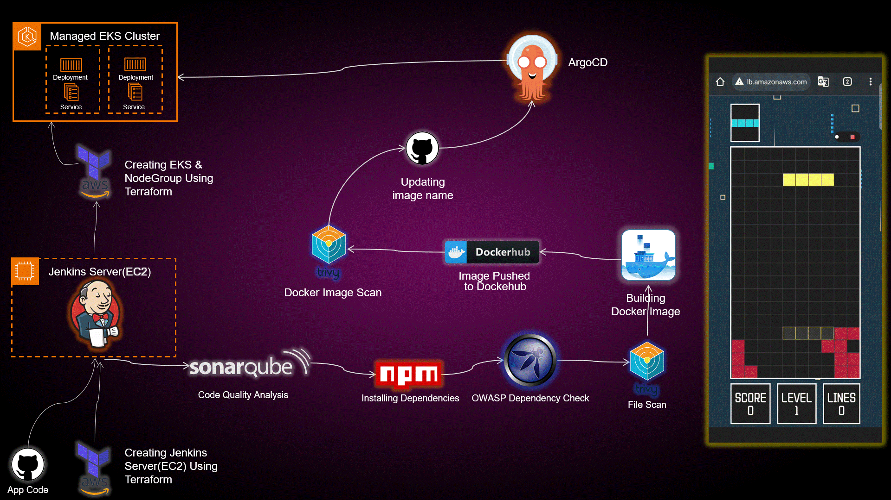

<div align="center">

# 🚀 End-to-End DevSecOps Kubernetes Project 🌐

     




</div>

---

## 📂 Directories

| Folder | Description |
|---|---|
| 📁 **EKS-TF** | Terraform scripts for deploying EKS clusters on AWS |
| 📁 **Jenkins-Pipeline-Code** | Jenkins pipeline code for automated CI/CD |
| 📁 **Jenkins-Server-TF** | Terraform scripts for provisioning Jenkins servers on AWS EC2 |
| 📁 **Manifest-file** | Kubernetes manifest files for Tetris application deployment |
| 📁 **Tetris-V1** | Initial version of the Tetris game application |
| 📁 **Tetris-V2** | Enhanced version of the Tetris game application |

---

## 🧠 Project Overview

This project demonstrates a **Production-grade DevSecOps pipeline** built from the ground up — combining **security**, **automation** and **cloud-native deployment** into a single seamless workflow. Using a fun Tetris game as the application, it walks through every layer of a modern software delivery pipeline — from writing code to deploying on Kubernetes with full security scanning at every step.

---

## 🏗️ Architecture at a Glance

```
Developer Push
      │
      ▼
 GitHub Repo
      │
      ▼
 Jenkins CI/CD Pipeline
  ├── 🧹 Workspace Cleanup
  ├── 📥 Git Checkout
  ├── 🔍 SonarQube Code Analysis
  ├── ✅ Quality Gate Check
  ├── 📦 Install Dependencies
  ├── 🛡️ OWASP Dependency Scan
  ├── 🔬 Trivy File System Scan
  ├── 🐳 Docker Build & Push
  ├── 🔎 Trivy Image Scan
  └── 📝 Update Kubernetes Manifest
            │
            ▼
       ArgoCD (GitOps)
            │
            ▼
      AWS EKS Cluster
            │
            ▼
     Live Tetris App 🎮
```

---

## 🔧 Tech Stack

| Layer | Tool | Purpose |
|---|---|---|
| ☁️ Cloud | AWS (EC2, EKS) | Infrastructure & Kubernetes hosting |
| 🏗️ IaC | Terraform | Provision EKS cluster & Jenkins server |
| 🔁 CI/CD | Jenkins | Automated build & deployment pipeline |
| 📦 Containerization | Docker | Build & package the application |
| 🚀 GitOps CD | ArgoCD | Sync Kubernetes manifests automatically |
| 🔍 Code Quality | SonarQube | Static code analysis |
| 🛡️ Dependency Scan | OWASP | Detect vulnerable dependencies |
| 🔬 Image Scan | Trivy | Scan filesystem & Docker images |
| 🐙 Source Control | GitHub | Code & manifest repository |
| ☸️ Orchestration | Kubernetes (EKS) | Run and scale the application |

---

## 🔐 Security at Every Stage (DevSecOps)

| Stage | Tool | What it Does |
|---|---|---|
| 🔍 Code Analysis | SonarQube | Catches code smells, bugs, and vulnerabilities before build |
| ✅ Quality Gate | SonarQube | Pipeline fails automatically if code quality drops below threshold |
| 🛡️ Dependency Scan | OWASP | Flags known CVEs in third-party packages |
| 🔬 Filesystem Scan | Trivy | Scans the project filesystem before Docker build |
| 🐳 Image Scan | Trivy | Scans the final Docker image for OS & library vulnerabilities |

---

## ⚙️ CI/CD Pipeline Breakdown

### 1️⃣ Jenkins Pipeline (CI)
- Triggers on every push to the repository
- Runs all security scans in sequence
- Builds and pushes Docker image to DockerHub with the Jenkins `BUILD_NUMBER` as the image tag
- Automatically updates the Kubernetes `deployment-service.yml` manifest with the new image tag
- Commits and pushes the updated manifest back to GitHub

### 2️⃣ ArgoCD (CD)
- Watches the `Manifest-file` directory in GitHub
- Detects manifest changes automatically
- Syncs and deploys the new version to the **AWS EKS cluster** without any manual step

---

## 🌍 Infrastructure Provisioning

### 🖥️ Jenkins Server (EC2)
```bash
cd Jenkins-Server-TF
terraform init
terraform apply
```

### ☸️ EKS Cluster
```bash
cd EKS-TF
terraform init
terraform apply
```

---

## 🎮 Application — Tetris (V1)

### 📌 What is Tetris V1?
Tetris V1 is the **first and base version** of the Tetris web application used in this project. It serves as the **initial deployment target** — the starting point of the entire DevSecOps pipeline. It is a fully playable, browser-based Tetris game built with **React.js** and containerized using Docker.

### 🗂️ Directory Structure
```
Tetris-V1/
  ├── public/           # Static assets
  ├── src/              # React source code
  │   ├── components/   # Game components (Board, Tetromino, Score)
  │   ├── App.js        # Root component
  │   └── index.js      # Entry point
  ├── Dockerfile        # Container build instructions
  ├── package.json      # Node.js dependencies
  └── package-lock.json
```

### ⚙️ How It Works
- Built using **React.js** — renders the Tetris game board and handles user input
- **Dockerfile** packages the app into a lightweight container using a multi-stage build:
  - Stage 1: Builds the React app using Node.js
  - Stage 2: Serves the built files using Nginx
- The final image is pushed to **DockerHub** as `tetrisv1:<BUILD_NUMBER>`

### 🐳 Dockerfile (V1)
```dockerfile
FROM node:16-alpine AS builder
WORKDIR /app
COPY package*.json ./
RUN npm install
COPY . .
RUN npm run build

FROM nginx:alpine
COPY --from=builder /app/build /usr/share/nginx/html
EXPOSE 80
CMD ["nginx", "-g", "daemon off;"]
```

### 🚀 Pipeline Role of V1
- It is the **first image built and deployed** to EKS
- The Kubernetes manifest `deployment-service.yml` initially points to `tetrisv1:1`
- Every Jenkins build increments the tag: `tetrisv1:2`, `tetrisv1:3`, and so on
- ArgoCD picks up the manifest change and rolls out the update automatically

### 🎯 Key Features of V1
- ✅ Classic Tetris gameplay in the browser
- ✅ Responsive design
- ✅ Score tracking
- ✅ Clean, minimal UI
- ✅ Fully containerized and cloud-deployable

---

## 🎮 Application — Tetris (V2)

### 📌 What is Tetris V2?
Tetris V2 is the **enhanced and upgraded version** of the Tetris application. It is used in this project to demonstrate a **real-world rolling update scenario** — simulating what happens when a development team ships a new feature release through the same DevSecOps pipeline without any downtime.

### 🗂️ Directory Structure
```
Tetris-V2/
  ├── public/           # Static assets (updated branding/icons)
  ├── src/              # React source code
  │   ├── components/   # Updated game components
  │   ├── App.js        # Updated root component
  │   └── index.js      # Entry point
  ├── Dockerfile        # Container build instructions
  ├── package.json      # Updated dependencies
  └── package-lock.json
```

### ⚙️ What's New in V2?

| Feature | V1 | V2 |
|---|---|---|
| 🎨 UI Design | Basic minimal UI | Polished, modern UI with better styling |
| 🎚️ Game Levels | Single speed | Multiple difficulty levels |
| 🏆 Score System | Basic score | High score tracking & level multiplier |
| ✨ Visual Effects | None | Improved animations & color themes |
| 📱 Mobile Support | Limited | Better responsive design |
| 🏷️ Branding | Generic | Custom project branding |

### 🐳 Dockerfile (V2)
```dockerfile
FROM node:16-alpine AS builder
WORKDIR /app
COPY package*.json ./
RUN npm install
COPY . .
RUN npm run build

FROM nginx:alpine
COPY --from=builder /app/build /usr/share/nginx/html
EXPOSE 80
CMD ["nginx", "-g", "daemon off;"]
```

### 🚀 Pipeline Role of V2
- V2 is used to **demonstrate a live upgrade** from V1 without downtime
- When the Jenkinsfile is pointed to the `Tetris-V2` directory, the pipeline:
  1. Builds a new Docker image from the V2 source
  2. Pushes it as `tetrisv2:<BUILD_NUMBER>`
  3. Updates `deployment-service.yml` with the new image tag
  4. ArgoCD detects the change and performs a **rolling update** on EKS — old pods are replaced one by one with zero downtime

### 🔄 Rolling Update Flow (V1 → V2)
```
EKS Cluster (Before)          EKS Cluster (After)
┌─────────────────┐           ┌─────────────────┐
│  Pod: tetrisv1  │           │  Pod: tetrisv2  │
│  Pod: tetrisv1  │  ──────►  │  Pod: tetrisv2  │
│  Pod: tetrisv1  │           │  Pod: tetrisv2  │
└─────────────────┘           └─────────────────┘
     (Old Version)                 (New Version)
   Zero Downtime Rolling Update via ArgoCD
```

### 🎯 Key Features of V2
- ✅ All V1 features retained
- ✅ Enhanced gameplay experience
- ✅ Better visual design and animations
- ✅ Demonstrates GitOps-driven rolling deployments
- ✅ Production-ready upgrade scenario

---

## 📈 How It All Connects

```
1️⃣  You push code          →   Jenkins triggers automatically
2️⃣  Jenkins scans & builds →   New Docker image tagged tetrisv1:BUILD_NUMBER
3️⃣  Jenkins updates YAML   →   deployment-service.yml pushed to GitHub
4️⃣  ArgoCD detects change  →   Syncs new manifest to EKS
5️⃣  App is live 🎯         →   Secure, automated, end-to-end traceable
```

---
<div align="center">

## 👨‍💻 Author

**NIHAL N** — DevSecOps & Cloud Engineer

[](https://www.linkedin.com/in/nihal-n-cse/)

---

⭐ *If this project helped you learn DevSecOps, give it a star and share it with your team!*

</div>
